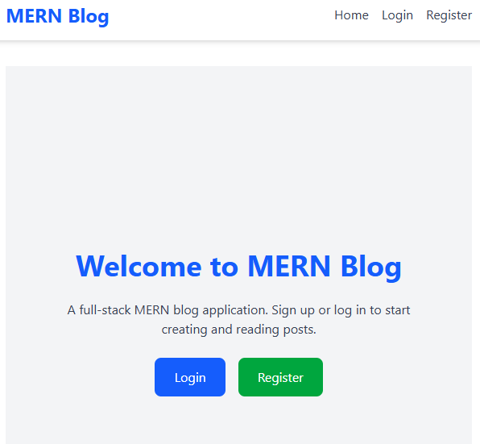
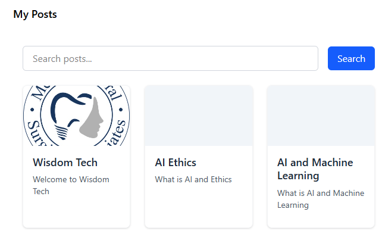
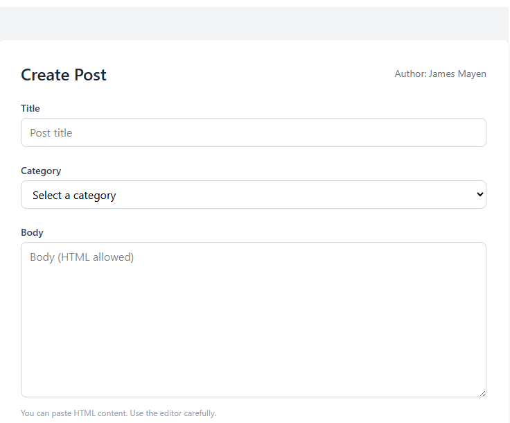

# 📰 MERN Blog Application

## 🧩 Project Overview
The **MERN Blog Application** is a full-stack blogging platform built using **MongoDB**, **Express**, **React**, and **Node.js**.  
It enables users to **create, view, edit, and delete posts**, as well as **interact with others** through **comments, replies, and likes**.

This project demonstrates a **complete MERN workflow**, including:
- RESTful backend APIs for post and comment management
- React frontend with authentication and dashboard pages
- JWT-based secure authentication
- MongoDB integration for storing user and post data

It is designed for **community-driven blogging** — allowing multiple users to share and engage with posts interactively.

---

## ✨ Features Implemented

### 👤 User Authentication
- Register and login using **JWT tokens**
- Role-based access (normal users vs. authors)
- Persistent authentication with token storage

### 📝 Posts Management
- Create, read, update, and delete blog posts
- Upload featured images for posts via **Multer**
- Filter posts by category or author
- Dashboard view for managing own posts

### 💬 Comments & Interaction
- Add, edit, and delete comments
- Reply to comments
- Like and unlike comments
- Real-time UI update after user actions

### 🎨 Frontend
- Built with **React (Vite)** for speed
- Styled using **Tailwind CSS**
- Responsive layout for all devices
- Dynamic rendering of posts, likes, and comments
- Dashboard and Community views for post discovery

### ⚙️ Backend
- **Node.js + Express.js REST API**
- **MongoDB + Mongoose** for data modeling
- **JWT** authentication middleware
- **Multer** for file uploads
- Proper error handling and validation

---

## 🖼️ Screenshots

### 🏠 Home Page


### 🧑‍💻 Dashboard


### 📝 Post View


### ✏️ Create Post



## 🏗️ System Architecture

```
MERN-Blog/
├── backend/
| ├── config
| | ├── db.js
│ ├── controllers/
│ │ └── postController.js
│ │ └── categoryController.js
│ │ └── chatController.js
│ │ └── authController.js
│ ├── middleware/
│ │ └── authMiddleware.js
│ │ └── errorandler.js
│ │ └── upload.js
│ ├── models/
│ │ ├── Post.js
│ │ ├── User.js
│ │ └── Category.js
│ │ └── Message.js
│ ├── routes/
│ │ └── posts.js
│ │ └── auth.js
│ │ └── categories.js
│ │ └── chat.js
│ ├── scripts/
| | ├── setPassword.js
│ ├── uploads/
│ ├── node_modules/
│ └── server.js
│ └── package.json
│
├── frontend/
| ├── node_modules
│ ├── src/
│ │ ├── api/
│ │ ├── components/
| | | ├── apiClient.js
| | | ├── ChatMessage.jsx
| | | ├── Navbar.jsx
| | | ├── Pagination.jsx
| | | ├── PostCard.jsx
| | | ├── ProtectedRoute.jsx
│ │ ├── context/
| | | ├── AuthContext.jsx
│ │ ├── hooks/
| | | ├── useApi.js
│ │ ├── utils/
| | | ├── formatDate.js
│ │ ├── pages/
│ │ │ ├── Home.jsx
│ │ │ ├── Dashboard.jsx
│ │ │ └── PostView.jsx
│ │ │ └── AllPosts.jsx
│ │ │ └── Chat.jsx
│ │ │ └── createEditpost.jsx
│ │ │ └── LandingPage.jsx
│ │ │ └── Login.jsx
│ │ │ └── Register.jsx
│ │ └── App.jsx
│ ├── public/
│ └── vite.config.js
│
├── screenshots/
│ ├── Home-1.png
│ ├── Home-2.png
│ ├── Dashboard-1.png
│ ├── post-1.png
│ ├── post-2.png
│ └── create-1.png
│ └── create-2.png
│ └── chat.png
|
├── .env
├── .gitignore
├── README.md
└── package.json

```

---

## ⚙️ Setup Instructions

### 🧠 Prerequisites
Ensure you have:
- Node.js (v18 or later)
- npm or yarn
- MongoDB (local or Atlas cloud instance)
- Git

### 🚀 Clone Repository
```bash
git clone https://github.com/yourusername/mern-blog-app.git
cd mern-blog-app
